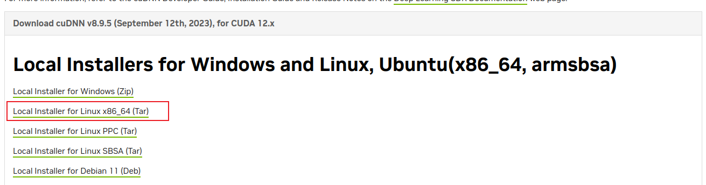

# Install-CUDA-12-cuDNN-8.9.5-PyTorch-v1.8.0-or-v1.9.0-and-python-3.9-for-deep-learning

* For avioding future errors plz install all these in a virtual enviroment.

## 1. Configuration
Ubuntu setup by running the following commands.

    sudo apt-get update sudo apt-get upgrade -y
    sudo apt-get install -y build-essential cmake unzip pkg-config
    sudo apt-get install -y libxmu-dev libxi-dev libglu1-mesa libglu1-mesa-dev
    sudo apt-get install -y libjpeg-dev libpng-dev libtiff-dev
    sudo apt-get install -y libavcodec-dev libavformat-dev libswscale-dev libv4l-dev
    sudo apt-get install -y libxvidcore-dev libx264-dev
    sudo apt-get install -y libgtk-3-dev
    sudo apt-get install -y libopenblas-dev libatlas-base-dev liblapack-dev gfortran
    sudo apt-get install -y libhdf5-serial-dev graphviz
    sudo apt-get install -y python3-dev python3-tk python-imaging-tk
    sudo apt-get install -y linux-image-generic linux-image-extra-virtual
    sudo apt-get install -y linux-source linux-headers-generic

## 2. Nvidia (Driver,CUDA, cuDNN)
### 2.1 Install Nvidia Driver
* Step 1 : Remove existing Nvidia drivers if any

      sudo apt-get purge nvidia*

* Step 2: Add Graphic Drivers PPA

      sudo add-apt-repository ppa:graphics-drivers/ppa
      sudo apt-get update

* Step 3: Search available drivers

      ubuntu-drivers devices

* Step 4: Install the driver with the best version

      sudo apt-get install nvidia-driver-"best_version"

  <i>Reboot your computer after installation!!!</i>
  
  <b>Verification</b>

  Type `nvidia-smi` in your evironment to see the GPU info and the processes that are using Nvidia GPU

  
  
### 2.2 Install CUDA 12.3 Toolkit
* If you want to install CUDA 12.3 version then follow steps otherwise go to <a href = "https://developer.nvidia.com/cuda-toolkit">CUDA Toolkit Downloads</a> for your specified version and follow the steps of <u>Base installer</u> only.
* <i><b>Note -</b> At the time of making this documentation only deb(local) installer type was working.</i>
  #### Base Installer
  * Run the following code in terminal

	wget https://developer.download.nvidia.com/compute/cuda/repos/ubuntu2204/x86_64/cuda-ubuntu2204.pin

	sudo mv cuda-ubuntu2204.pin /etc/apt/preferences.d/cuda-repository-pin-600
	wget https://developer.download.nvidia.com/compute/cuda/12.3.0/local_installers/cuda-repo-ubuntu2204-12-3-local_12.3.0-545.23.06-1_amd64.deb

	sudo dpkg -i cuda-repo-ubuntu2204-12-3-local_12.3.0-545.23.06-1_amd64.deb

	sudo cp /var/cuda-repo-ubuntu2204-12-3-local/cuda-*-keyring.gpg /usr/share/keyrings/

	sudo apt-get update

	sudo apt-get -y install cuda-toolkit-12-3

  #### Add Cuda to Path
  * in Terminal activate your environment and write the following codes.

  	`sudo nano ~/.ba`

  * Press ESC then i for inserting mode.
  * Now go to end and paste these.
  
  		if [ -d "/usr/local/cuda/bin/" ]; then

			export PATH=/usr/local/cuda/bin${PATH:+:${PATH}}

    		export LD_LIBRARY_PATH=/usr/local/cuda/lib64${LD_LIBRARY_PATH:+:${LD_LIBRARY_PATH}}

		fi

  <b>Verification</b>
    
	nvcc --version

	

### 2.3 Install cuDNN 
* Just go <a href = 'https://developer.nvidia.com/cudnn'>here</a>. You'll have to log in and download the tar file , so downloading of the right cuDNN binary packages cannot be easily automated.

	

* Once downloaded, un-tar the file and copy the contents to their respective locations:

		$ tar -xvf cudnn-linux-x86_64-8.9.5.29_cuda12-archive.tar.xz

* Copy the following files into the CUDA toolkit directory.

		$ sudo cp cudnn-*-archive/include/cudnn*.h /usr/local/cuda/include 
		$ sudo cp -P cudnn-*-archive/lib/libcudnn* /usr/local/cuda/lib64 
		$ sudo chmod a+r /usr/local/cuda/include/cudnn*.h /usr/local/cuda/lib64/libcudnn*

## 3. Now install Tensorflow and PyTorch for verification

* Use the test_gpu.ipynb file in repo 

